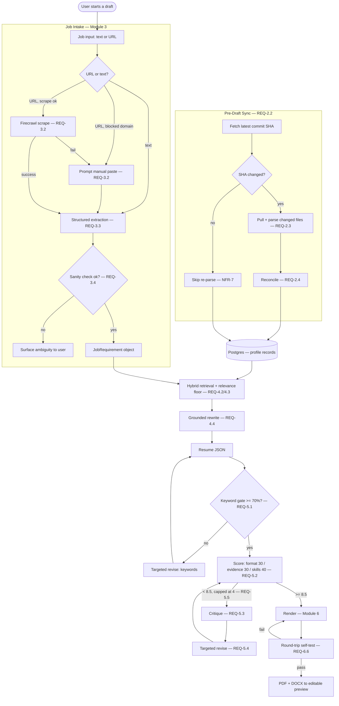

# Resumer AI — Technical Design

Maps every requirement in `requirements.md` to a concrete technical solution. Rationale, research, and rejected alternatives live in `PLAN.md` — this document states the "how" without re-arguing the "why."

---

## 1. Architecture Overview



---

## 2. Tech Stack

| Concern | Choice |
|---|---|
| Framework | Next.js (App Router), TypeScript |
| Database | Postgres (Neon via Vercel Marketplace), Drizzle ORM, `pgvector` for embeddings |
| Auth | Clerk, GitHub primary provider (REQ-7.1) |
| AI orchestration | Vercel AI SDK v6, provider-agnostic |
| AI providers (routing order) | Gemini → Groq → DeepInfra → Together AI → Fireworks AI |
| Job-URL scraping | Firecrawl (scrape API, JSON schema extraction) |
| ATS validation | `mammoth`, `pdf-parse`, OpenResume (self-hosted, free tier), Affinda or RChilli (paid, final-pass tier) |
| Rendering | `@react-pdf/renderer` (PDF), `docx` npm package (DOCX) |
| File storage | Vercel Blob |
| Background jobs | Vercel Cron (daily sync), optional GitHub webhook (REQ-2.5) |
| Streaming | Server-Sent Events over a Node.js route (Fluid Compute — no Edge runtime needed) |
| Styling | Tailwind CSS + shadcn/ui |

---

## 3. Data Model

```ts
// Every table carries userId (NFR-6), even single-user.

interface ProfileRecordBase {
  id: string;
  userId: string;
  source: 'manual' | 'github-sync' | 'ai-import';   // REQ-1.2
  contentHash: string;                               // REQ-1.2, REQ-2.4
  tags: string[];                                    // skills/keywords demonstrated
  createdAt: Date;
  updatedAt: Date;
}

interface Skill extends ProfileRecordBase {
  type: 'skill';
  name: string;
  category: 'language' | 'framework' | 'tool' | 'soft-skill';
  proficiency?: string;
  yearsOfExperience?: number;
  lastUsed?: Date;
}

interface ExperienceBullet extends ProfileRecordBase {
  type: 'experience-bullet';
  roleId: string;          // parent role/employer
  action: string;
  metric?: string;
  outcome?: string;
  dateRange: { start: string; end: string | 'present' };  // spelled-out on render, REQ-6.1
}

interface Project extends ProfileRecordBase {
  type: 'project';
  name: string;
  description: string;
  stack: string[];
  links: string[];
  impactMetrics?: string[];
}

interface EducationOrCert extends ProfileRecordBase { /* standard fields */ }
interface Achievement extends ProfileRecordBase { /* awards, publications, talks */ }

// REQ-1.3 — reserved, unused until Phase 10
interface ApplicationFormFields {
  userId: string;
  workAuthorization?: string;
  visaSponsorshipNeeded?: boolean;
  eeoAnswers?: Record<string, string>;
  salaryExpectation?: string;
  noticePeriod?: string;
}

interface JobRequirement {   // REQ-3.3
  roleTitle: string;
  seniority: string;
  category: 'SEO' | 'Full Stack' | 'AI Engineer' | 'PM' | string;
  requiredSkills: string[];
  preferredSkills: string[];
  responsibilities: string[];
  atsKeywords: string[];
  companyContext?: string;
  tone: 'startup' | 'corporate' | string;
  confidence: number;        // REQ-3.4 sanity-check output
  flags: string[];           // contradictions/ambiguity notes
}

interface ResumeDocument {   // REQ-4.4 output / REQ-6.3 render input
  id: string;
  userId: string;
  jobRequirementSnapshot: JobRequirement;
  sections: Array<{
    heading: string;          // must match REQ-6.1 allow-list
    items: Array<{
      text: string;
      sourceRecordId: string;   // traceability — Section 9 "source trace" in PLAN.md
    }>;
  }>;
  score: QualityGateResult;
  renderMode: 'ats-strict' | 'presentation';
  format: 'pdf' | 'docx';
  fileName: string;           // REQ-6.4
  recordHashSnapshot: string[]; // REQ-9.2 immutability
  createdAt: Date;
}

interface QualityGateResult {   // REQ-5.2
  keywordGatePassed: boolean;
  keywordCoveragePct: number;
  formattingScore: number;   // 0-1, weight 0.30
  evidenceScore: number;     // 0-1, weight 0.30 — AI-judged
  skillsCompletenessScore: number; // 0-1, weight 0.40
  overall: number;           // 0-10
  iterations: number;        // capped at 4, REQ-5.5
  critiques: string[];
}

interface ApplicationTrackerEntry {   // Module 9
  id: string;
  userId: string;
  resumeSnapshotId: string;   // REQ-9.2
  jobRequirementSnapshot: JobRequirement;
  status: 'applied' | 'interview' | 'rejected' | 'offer';
  appliedAt: Date;
  updatedAt: Date;
}

interface AuditLogEntry {   // REQ-10.1
  id: string;
  userId: string;
  recordId: string;
  action: 'create' | 'update' | 'flag-removed' | 'delete';
  source: 'manual' | 'github-sync' | 'ai-import';
  diff: Record<string, { before: unknown; after: unknown }>;
  timestamp: Date;
}
```

---

## 4. Module Designs

### 4.1 GitHub Sync (REQ-2.1–2.5)
- OAuth: Clerk's GitHub provider configured with `repo` scope (read-only usage enforced at the application layer, not the token layer — GitHub OAuth scopes don't grant read-only repo access at finer granularity than `repo`, so the app code itself never issues write calls).
- Sync check: `GET /repos/{owner}/{repo}/commits/{branch}` → compare `sha` to `lastSyncedSha` stored per user.
- Parser: for structured files (`content/*.json`, `*.mdx`, `*.yaml`), direct parse. For component source (`.tsx`/`.jsx` with hardcoded data), an AI extraction call with a Zod schema matching the `Skill`/`Project`/`ExperienceBullet` shapes.
- Reconciliation: match by `contentHash`; new hash + no existing record → insert; existing record, changed hash, `source: github-sync` → update; existing record, hash not found in latest parse → set `flaggedForRemoval: true`, never delete outright.
- Webhook (REQ-2.5): a `push` event on the portfolio repo hits a Vercel Function route that clears `lastSyncedSha`, forcing the next draft's check to re-pull.

### 4.2 Job Intake (REQ-3.1–3.4)
- Domain blocklist for REQ-3.2: `linkedin.com`, `indeed.com`, `glassdoor.com` (and subdomains) — checked before any Firecrawl call.
- Firecrawl call: `scrape` endpoint with a JSON schema matching `JobRequirement`'s core fields (title, company, responsibilities, skills).
- Extraction: `generateObject` (AI SDK) with a Zod schema for `JobRequirement`.
- Sanity check (REQ-3.4): a deterministic rule set (seniority-vs-years lookup table) plus one small AI call flagging internal contradiction; result populates `confidence` and `flags` on the `JobRequirement`.

### 4.3 Retrieval & Generation (REQ-4.1–4.5)
- Section weighting: a static config `Record<RoleCategory, SectionEmphasis>` — deterministic, versioned in code, user-editable per REQ-4.2's hand-tuning requirement.
- Relevance floor: a per-category minimum tag-overlap threshold; records below it are excluded from the candidate set entirely before ranking (not just down-weighted).
- Hybrid ranking: `finalScore = keywordOverlapScore * 0.6 + embeddingSimilarity * 0.4` (weights tunable), computed only over records that cleared the relevance floor.
- Grounded rewrite: prompt template enforces "rephrase only; you may not add any noun, number, or claim absent from the provided source text," validated post-hoc by checking that all named entities/numbers in the output bullet appear in the source bullet.

### 4.4 Quality Gate (REQ-5.1–5.6)
- Keyword gate: exact + fuzzy (Levenshtein-tolerant) match of `atsKeywords` against combined Skills-section + bullet text; `coveragePct = matched / total`.
- Weighted score: formatting/skills-completeness are pure functions over the `ResumeDocument`; evidence score is one `generateObject` call returning a 0–1 score + per-bullet notes, run via the Groq-first routing chain for latency.
- Loop controller: implemented as an AI SDK multi-step agent loop with `stopWhen: (state) => state.score >= 8.5 || state.iterations >= 4 || state.circuitBreakerTripped`.
- Circuit breaker (REQ-5.6): a running counter of AI calls/tokens per draft, checked before every call in the loop; a separate daily counter per user checked before any AI call anywhere in the app.

### 4.5 Rendering (REQ-6.1–6.7)
- Section-heading allow-list: a `Record<string, string[]>` (e.g. `Experience: ['Experience', 'Work Experience', 'Professional Experience', 'Employment History']`) enforced at render time — any heading not in the list is rejected before rendering, not silently passed through.
- PDF: `@react-pdf/renderer`, text nodes only (no `<Image>` for text content) — guarantees the embedded-text-layer requirement.
- DOCX: `docx` package, built from the same `ResumeDocument` walk as the PDF renderer (shared section-iteration logic, two output adapters).
- Self-test (REQ-6.6): after render, run `mammoth`/`pdf-parse` + OpenResume against the output file; assert extracted name/email/phone/URLs/skills match the source `ResumeDocument` fields; on the final passing draft only, one Affinda/RChilli API call for the stronger field-mapping check.

### 4.6 UI/UX (REQ-8.1–8.5)
- Streaming: a single `POST /api/resume/draft` route returns `text/event-stream`; each pipeline stage emits a named SSE event (`sync`, `understand`, `retrieve`, `draft`, `score` [repeatable], `finalize`) with a small JSON payload the client renders into the live panel.
- Client state: the pipeline panel is a simple reducer over incoming SSE events — no polling, no fake timers.
- Responsive: Tailwind breakpoints `sm`/`md`/`lg`; the profile dashboard and recent-drafts table switch to stacked-card layout below `md`.

---

## 5. Error Handling Strategy

| Failure | Handling |
|---|---|
| GitHub API unreachable during sync | Proceed with existing profile, surface a non-blocking warning in the sync-status card; log for REQ-10.2 alerting |
| Firecrawl scrape fails / times out | Fall back to manual-paste prompt (REQ-3.2) — never a dead end |
| All 5 AI providers fail for a given call | Surface an explicit error state in the live pipeline (REQ-10.2), not a silent hang |
| Quality gate never clears 8.5 in 4 iterations | Honest-failure state (REQ-5.5) — best-scoring version shown with an explanation, never a forced pass |
| Round-trip self-test finds corruption | Re-render once; if it fails twice, surface as a render error rather than deliver a bad file |
| Circuit breaker trips mid-loop | Same honest-failure state as REQ-5.5, distinct message noting the cost/call cap was the cause |

---

## 6. Testing Strategy

- **Deterministic checks** (formatting compliance, keyword coverage, skills completeness, heading allow-list) get unit tests with fixed input/output pairs — no AI involved, so these are fully deterministic to test.
- **Grounded rewrite** gets a property test: for N sample source bullets, assert every generated rewrite's named entities/numbers are a subset of the source's.
- **Sync reconciliation** gets fixture-based tests: a before/after pair of mock repo content, asserting the correct add/update/flag-removed classification.
- **Round-trip self-test** itself doubles as an integration test — run it against hand-crafted "known-bad" templates (a table, a rasterized PDF, an icon-font glyph) to confirm it actually catches what it claims to.

---

## 7. Design Tokens (REQ-8.4)

Full palette table, contrast measurements, and typography rationale are in `PLAN.md` §9 (confirmed as **Tidewater v2**). Canonical token values for implementation:

```css
:root {
  --paper: #F5F6F8; --surface: #FFFFFF; --ink: #14161C; --muted: #5B6270; --border: #E4E6EB;
  --brand: #0E7C86; --brand-dark: #0A5F67; --brand-tint: #E4F1F1;
  --gold: #96691D; --gold-bright: #C9922F; --gold-tint: #F6EEDD;
  --success: #197A42; --success-tint: #E5F4EB;
  --warning: #A85F12; --warning-tint: #FBEEDD;
  --danger: #C43D3D;
}
/* dark-mode overrides: see PLAN.md §9 / former mockups/tidewater.html for exact values */
```

Typography: **Instrument Serif** (headings, regular weight only), **General Sans** (Fontshare — body/UI), **Spline Sans Mono** (scores, keyword chips, file names, tabular figures).

---

## 8. Requirement Traceability Summary

Every REQ-ID in `requirements.md` is addressed above under its matching module (§4.1–4.6) or as a cross-cutting concern (§2 tech stack for NFR-1/2/6/7, §5 for error handling, §7 for NFR-4/REQ-8.4). `tasks.md` breaks each into buildable work items citing these same IDs.
